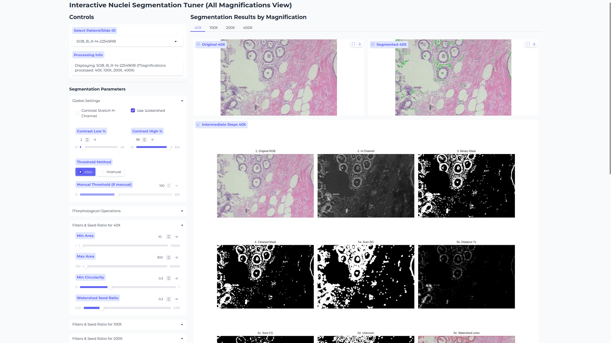

# 🔬 Decisional Breast Cancer: Advanced Nuclei Analysis Pipeline

[](https://www.python.org/downloads/)
[](https://opensource.org/licenses/MIT) <!-- Choose an appropriate license -->

An end-to-end pipeline for breast cancer histology image analysis, featuring advanced nuclei segmentation, feature extraction, and SVM-based classification. This project provides tools for both fine-tuning segmentation parameters and running the complete machine learning workflow.

---

## ✨ Features

- **Advanced Nuclei Segmentation:** Utilizes color deconvolution (Hematoxylin channel), adaptive thresholding, morphological operations, and optional watershed for robust nuclei identification.
- **Interactive Parameter Tuning:** A Gradio-based UI (`segmentation_tuner.py`) allows for real-time visual feedback while adjusting segmentation parameters across different image magnifications (40X, 100X, 200X, 400X).
- **Comprehensive Feature Extraction:** Calculates a suite of morphological and texture-based features for each segmented nucleus, aggregated per image.
- **Patient-Level Data Splitting:** Ensures robust model evaluation by splitting data at the patient/slide level, preventing data leakage.
- **SVM Classification:** Implements a Support Vector Machine classifier for benign/malignant prediction.
- **Detailed Evaluation:** Provides accuracy, classification reports, confusion matrices, and ROC AUC scores.

---

## 🖼️ Sneak Peek: Segmentation Tuner UI

The interactive tuner allows for precise configuration of segmentation parameters with live visual feedback across all magnifications for a selected patient slide.




## 🚀 Getting Started

Follow these steps to set up and run the project on your local machine.

### 📋 Prerequisites

- Python 3.9 or higher
- Git (for cloning the repository)

### ⚙️ Setup Instructions

1.  **Clone the Repository:**

    ```bash
    git clone https://github.com/lado-saha/decisional-breast-cancer.git
    cd decisional-breast-cancer
    ```

2.  **Create and Activate a Virtual Environment (Recommended):**

    ```bash
    python3 -m venv venv
    source venv/bin/activate  # On Linux/macOS
    # venv\Scripts\activate   # On Windows
    ```

3.  **Install Dependencies:**
    Install the required Python packages from `requirements.txt`:

    ```bash
    pip install -r requirements.txt
    ```

4.  **Configure `ipywidgets` for Jupyter (Important!):**
    For the `pipeline_final.ipynb` notebook to display progress bars correctly, `ipywidgets` needs to be enabled:

    - **For Jupyter Notebook:**
      ```bash
      jupyter nbextension enable --py widgetsnbextension --sys-prefix
      ```
    - **For JupyterLab:**
      You might also need `jupyterlab-widgets`:
      `bash
      pip install jupyterlab-widgets
      jupyter labextension develop --overwrite widgetsnbextension

    `
    After these commands, **restart your Jupyter server and kernel.**

5.  **Dataset Preparation:**
    - Obtain the breast cancer histology image dataset (approx. 4GB, usually provided as a ZIP file).
    - Create a directory named `raw` in the root of the `decisional-breast-cancer` project folder.
    - Extract the entire contents of the dataset ZIP file _directly_ into this `raw` folder.
    - The expected structure within `raw` is:
      ```
      decisional-breast-cancer/
      ├── raw/
      │   ├── benign/
      │   │   └── SOB/
      │   │       ├── adenosis/
      │   │       │   └── <patient_slide_id>/  (e.g., SOB_B_A_14-22549AB)
      │   │       │       ├── 40X/
      │   │       │       │   └── <image_file.png>
      │   │       │       ├── 100X/
      │   │       │       ├── 200X/
      │   │       │       └── 400X/
      │   │       └── ... (other benign subtypes & patient_slide_ids)
      │   └── malignant/
      │       └── SOB/
      │           ├── ductal_carcinoma/
      │           │   └── <patient_slide_id>/ (e.g., SOB_M_DC_14-10926)
      │           │       ├── 40X/
      │           │       └── ...
      │           └── ... (other malignant subtypes & patient_slide_ids)
      ├── pipeline_final.ipynb
      ├── segmentation_tuner.py
      ├── requirements.txt
      └── README.md
      ```

---

## 🎮 Usage

This project consists of two primary components:

### 1. Interactive Segmentation Parameter Tuner (`segmentation_tuner.py`)

This tool is essential for visually fine-tuning the advanced nuclei segmentation parameters.

- **Launch:**

  ```bash
  python segmentation_tuner.py
  ```

  Open the local URL (e.g., `http://127.0.0.1:7860`) printed in your terminal in a web browser.

- **How to Use:**
  1.  **Select Patient/Slide ID:** Use the dropdown in the left control panel. Results for all available magnifications for this ID will be displayed in the right panel under corresponding tabs (40X, 100X, 200X, 400X).
  2.  **Adjust Parameters:** Modify the sliders and inputs in the left panel (Global Settings, Morphological Ops, Magnification-Specific Filters). The image displays on the right will update live.
  3.  **Iterate:** Cycle through different patient/slide IDs and magnifications to ensure your parameters are robust.
  4.  **Save Configuration:** When satisfied, click "Save Current Settings to 'Saved Config' Display".
  5.  **Copy Tuned Config:** Carefully copy the JSON content from the "Saved Config" text box. This will be used in the main pipeline.

### 2. Main Machine Learning Pipeline (`pipeline_final.ipynb`)

This Jupyter Notebook executes the end-to-end workflow.

1.  **Launch Jupyter:**

    ```bash
    jupyter notebook  # or jupyter lab
    ```

    Open `pipeline_final.ipynb`.

2.  **Critical Step: Update `SEGMENTATION_CONFIG`:**

    - Navigate to **Cell [4] (Configuration)**.
    - Find the `SEGMENTATION_CONFIG = {...}` dictionary.
    - **Replace the example/default values with the JSON configuration you copied from the `segmentation_tuner.py` UI.** Ensure it's valid Python dictionary syntax.

3.  **Run the Notebook:**
    Execute all cells sequentially (e.g., Cell -> Run All). The pipeline will:

    - Load image paths and perform a patient-level train/test split.
    - Extract features using your tuned advanced segmentation.
    - Train an SVM model.
    - Evaluate the model and display performance metrics.

4.  **Review Results:**
    Analyze the outputs, especially the model evaluation metrics (accuracy, classification report, confusion matrix, ROC AUC) provided at the end of the notebook.

---

## 🛠️ Under the Hood: Segmentation Strategy

The `segment_nuclei_pipeline` function employs the following steps:

1.  **Color Deconvolution:** Isolates the Hematoxylin channel using `skimage.color.rgb2hed`.
2.  **Contrast Stretching (Optional):** Enhances the H-channel using `skimage.exposure.rescale_intensity`.
3.  **Thresholding:** Creates a binary mask using Otsu's method or a manual threshold.
4.  **Morphological Operations:** Cleans the mask using `cv2.MORPH_OPEN` and `cv2.MORPH_CLOSE`.
5.  **Watershed Segmentation (Optional):** Separates touching nuclei using `cv2.distanceTransform` for seeds and `cv2.watershed`.
6.  **Contour Filtering:** Refines detected objects based on area and circularity, with parameters specific to each image magnification.

---

## 🤝 Contributing

Contributions, issues, and feature requests are welcome! Please feel free to:

- Open an issue if you encounter a bug or have a suggestion.
- Fork the repository and submit a pull request with your improvements.

---

## 📝 License

This project is licensed under the MIT License - see the [LICENSE.md](LICENSE.md) file for details (if you add one).

<!-- **ACTION REQUIRED:** Create a LICENSE.md file with your chosen license (e.g., MIT) -->

---

**Happy Analyzing!** 💡
